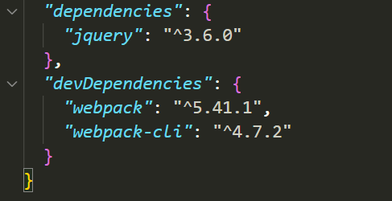

# Node入门

**Q: Nodejs是什么?它是一门语言吗？**

## Node简介

Node.js® is a JavaScript runtime built on [Chrome's V8 JavaScript engine](https://v8.dev/).

它可以：

1. 开发命令行工具如webpack-cli, vue-cli, create-react等等
2. 开发客户端程序如VS Code
3. 开发服务端程序如百度网盘的后端就是用express.js写的
4. 你能想到的主流语言如python，java等能做到的事它都能做到

### npm简介

**npm** (originally short for **Node Package Manager**)[[4\]](https://en.wikipedia.org/wiki/Npm_(software)#cite_note-4) is a [package manager](https://en.wikipedia.org/wiki/Package_manager) for the [JavaScript](https://en.wikipedia.org/wiki/JavaScript) programming language maintained by [npm, Inc](https://en.wikipedia.org/wiki/Npm,_Inc.).

安装Node的时候，会同时安装npm

它是Node的模块管理器，如果你学过python，可以将其与pip类比

### 练习一  使用webpack打包

#### 实验目的：体会Node在前端开发中的作用

#### **操作步骤**

1. 新建一个目录

```bash
$ mkdir demo
$ cd demo
```

2.  在该目录下新建package.json文件(npm的配置文件)

``` bash
$ npm init -y
```

​	3. 安装 `jquery`、`webpack`、`webpack-cli`这三个模块

```bash
$ npm i jquery
$ npm i -D webpack webpack-cli
```

打开package.json文件，你会发现`dependencies`和 `devDependencies`多了几行代码，具体如图：



4. 在项目根目录下，新建一个网页文件`index.html`。

```html
<!DOCTYPE html>
<html lang="en">
<head>
    <meta charset="UTF-8">
    <meta http-equiv="X-UA-Compatible" content="IE=edge">
    <meta name="viewport" content="width=device-width, initial-scale=1.0">
    <title>webpack</title>
</head>
<body>
    <h1>Hello World!</h1>
    <script src="dist/main.js"></script>
    
</body>
</html>
```

5. 在项目根目录下，新建一个脚本文件`app.js`。

```javascript
const $ = require('jquery')
$('h1').css({color:'blue'})
```

6. 打开`package.json`，在`scripts`字段里面，添加一行。

```json
"scripts": {
    "build":"webpack --mode production ./app.js -o ./dist",
    "test": "echo \"Error: no test specified\" && exit 1"
 },
```

7. 在项目根目录下，执行下面的命令，将app.js打包

```bash
$ npm run build
```

​	执行完成后会发现项目目录下的`dist`文件夹下多了一个main.js文件

8. 浏览器打开`index.html`，可以发现`Hello World`变成了红色。

### **Node在前端开发中的作用**

1. 让前端也可以使用`nodejs`的特性
2. 方便版本管理
3. 方便对外发布
4. 持续集成的标准开发流程

## REST

### REST 概念

**表现层状态转换**（[英语](https://zh.wikipedia.org/wiki/英语)：**Representational State Transfer**，[缩写](https://zh.wikipedia.org/wiki/縮寫)：**REST**）是[Roy Thomas Fielding](https://zh.wikipedia.org/w/index.php?title=Roy_Thomas_Fielding&action=edit&redlink=1)博士于2000年在他的博士论文[[1\]](https://zh.wikipedia.org/wiki/表现层状态转换#cite_note-Fielding-Ch5-1)中提出来的一种[万维网](https://zh.wikipedia.org/wiki/万维网)[软件架构](https://zh.wikipedia.org/wiki/软件架构)风格，目的是便于不同软件/程序在网络（例如互联网）中互相传递信息。表现层状态转换是根基于[超文本传输协议（HTTP）](https://zh.wikipedia.org/wiki/超文本传输协议)之上而确定的一组约束和属性，是一种设计提供万维网络服务的[软件构建风格](https://zh.wikipedia.org/wiki/軟件架構)。符合或兼容于这种架构风格（简称为 REST 或 RESTful）的网络服务，允许客户端发出以[统一资源标识符](https://zh.wikipedia.org/wiki/统一资源标志符)访问和操作网络资源的请求，而与预先定义好的无状态操作集一致化。因此表现层状态转换提供了在互联网络的计算系统之间，彼此资源可交互使用的协作性质（interoperability）。

需要注意的是，REST是设计风格而**不是**标准。REST通常基于[HTTP](https://zh.wikipedia.org/wiki/HTTP)、[URI](https://zh.wikipedia.org/wiki/URI)、[XML](https://zh.wikipedia.org/wiki/XML)以及[HTML](https://zh.wikipedia.org/wiki/HTML)这些现有的广泛流行的协议和标准。

- 资源是由URI来指定。
- 对资源的操作包括获取、创建、修改和删除，这些操作正好对应HTTP协议提供的GET、POST、PUT和DELETE方法。
- 通过操作资源的表现形式来操作资源。
- 资源的表现形式则是XML或者HTML，取决于读者是机器还是人、是消费Web服务的客户软件还是Web浏览器。当然也可以是任何其他的格式，例如JSON。

### RESTFul API

符合REST设计风格的Web API称为**RESTful API**。它从以下三个方面资源进行定义：

- 直观简短的资源地址：URI，比如：`http://example.com/resources`。
- 传输的资源：Web服务接受与返回的[互联网媒体类型](https://zh.wikipedia.org/wiki/互联网媒体类型)，比如：[JSON](https://zh.wikipedia.org/wiki/JSON)，[XML](https://zh.wikipedia.org/wiki/XML)，[YAML](https://zh.wikipedia.org/wiki/YAML)等。
- 对资源的操作：Web服务在该资源上所支持的一系列[请求方法](https://zh.wikipedia.org/wiki/超文本传输协议#请求方法)（比如：POST，GET，PUT或DELETE）。

下表列出了在实现RESTful API时HTTP请求方法的典型用途。

|                          资源                          |                             GET                              |                          PUT                          |                             POST                             |        DELETE        |
| :----------------------------------------------------: | :----------------------------------------------------------: | :---------------------------------------------------: | :----------------------------------------------------------: | :------------------: |
|   一组资源的URI，比如`https://example.com/resources`   | **列出**URI，以及该资源组中每个资源的详细信息（后者可选）。  |       使用给定的一组资源**替换**当前整组资源。        | 在本组资源中**创建/追加**一个新的资源。该操作往往返回新资源的URL。 |  **删除**整组资源。  |
| 单个资源的URI，比如`https://example.com/resources/142` | **获取**指定的资源的详细信息，格式可以自选一个合适的网络媒体类型（比如：XML、JSON等） | **替换/创建**指定的资源。并将其追加到相应的资源组中。 | 把指定的资源当做一个资源组，并在其下**创建/追加**一个新的元素，使其隶属于当前资源。 | **删除**指定的元素。 |

PUT和DELETE方法是[幂等方法](https://zh.wikipedia.org/wiki/超文本传输协议#幂等方法)。GET方法是[安全方法](https://zh.wikipedia.org/wiki/超文本传输协议#安全方法)（不会对服务器端有修改，因此当然也是幂等的）。

### 练习二 

#### 实验目的

1. 熟悉 RESTFul API 的基本用法

#### 操作步骤

（1） 前两步同练习一(创建目录`rest-api`并进入然后执行`npm init -y`)，然后命令行进入`rest-api`目录，执行下面的命令。

```bash
$ npm i json-server
```

（2） 在项目根目录下，新建一个 JSON 文件`db.json`。

```json
{
  "posts": [
    { "id": 1, "title": "json-server", "author": "typicode" }
  ],
  "comments": [
    { "id": 1, "body": "some comment", "postId": 1 }
  ],
  "profile": { "name": "typicode" }
}
```

（3） 打开`package.json`，在`scripts`字段添加一行。

```json
"scripts": {
  "server": "json-server db.json",
  "test": "..."
},
```

（4） 命令行下执行下面的命令，启动服务。

```bash
$ npm run server
```

（5）打开Postman。依次向`http://127.0.0.1:3000/posts`、`http://127.0.0.1:3000/posts/1`发出`GET`请求，查看结果。

（6）向`http://127.0.0.1:3000/comments`发出`POST`请求。注意，数据体`Body`要选择`x-www-form-urlencoded`编码，然后依次添加下面两个字段。

```
body: "hello world"
postId: 1
```

发出该请求后，再向`http://127.0.0.1:3000/comments`发出`GET`请求，查看结果。

（7） 向`http://127.0.0.1:3000/comments/2`发出`PUT`请求，数据体`Body`要选择`x-www-form-urlencoded`编码，然后添加下面的字段。

```
body: "hello react"
```

发出该请求后，再向`http://127.0.0.1:3000/comments`发出`GET`请求，查看结果。

（8）向`http://127.0.0.1:3000/comments/2`发出`delete`请求。

发出该请求后，再向`http://127.0.0.1:3000/comments`发出`GET`请求，查看结果。

### REST的优点

- 可更高效利用缓存来提高响应速度
- 通讯本身的无状态性可以让不同的服务器的处理一系列请求中的不同请求，提高服务器的扩展性
- 浏览器即可作为客户端，简化软件需求
- 相对于其他叠加在[HTTP协议](https://zh.wikipedia.org/wiki/超文本传输协议)之上的机制，REST的软件依赖性更小
- 不需要额外的资源发现机制
- 在软件技术演进中的长期的兼容性更好

## Express

Expressjs is a fast, unopinionated, minimalist web framework for [Node.js](https://nodejs.org/en/).


### 练习三 Express的基本使用

#### 实验目的：掌握Express的基本使用

#### 实验步骤：

（1）进入`express-demo`目录，命令行执行下面的命令，安装依赖。

```bash
$ cd express-demo
$ npm i
```

（2）打开`app.js`，尝试看懂这个脚本。

```javascript
const express    = require('express');
const app        = express();
```

上面代码调用`express`，生成一个 Web 应用的实例。

```javascript
const router = express.Router();

router.get('/', function(req, res) {
  res.send('<h1>Hello World</h1>');
});

app.use('/home', router);
```

上面代码新建了一个路由对象，该对象指定访问根路由（`/`）时，返回`Hello World`。然后，将该路由加载在`/home`路径，也就是说，访问`/home`会返回`Hello World`。

`router.get`方法的第二个参数是一个回调函数`handler`，当符合指定路由的请求进来，会被这个函数处理。该函数的两个参数，`req`和`res`都是Express 内置的对象，分别表示用户的请求和 Web 服务器的回应。`res.send`方法就表示服务器回应所送出的内容。

```javascript
const PORT = process.env.PORT||8080
app.listen(PORT,()=>{
    console.log('Server has started on port '+PORT);
})
```

上面代码指定了外部访问的端口，如果环境变量没有指定，则端口默认为`8080`。最后两行是启动应用，并输出一行提示文字。

（3）在命令行下，启动这个应用。

```bash
$ node app.js
```

浏览器访问`localhost:8080/home`，看看是否输出`Hello World`。

然后，命令行下按 Ctrl + C，退出这个进程。

（4）通过环境变量，自定义启动端口。

假定我们指定必须启动在`7070`端口，命令行可以这样操作。

```bash
# Linux & Mac
$ PORT=7070 node app.js

# windows cmd / (git cmd)
$ set PORT=7070
$ node app.js

# windows powershell
$ $env:PORT=7070
$ node app.js
```

浏览器就可以访问`localhost:7070/home`了。

然后，命令行下按 Ctrl + C，退出这个进程。

思考题：Node 应用能否直接在`80`端口启动？

（5）打开`app.js`，查看新增的那个路由。

```javascript
router.get('/:name', function(req, res) {
  res.send('<h1>Hello ' + req.params.name + '</h1>');
});
```

上面代码新增了一个路由，这个路由的路径是一个命名参数`:name`，可以从`req.params.name`拿到这个传入的参数。

在命令行下，启动这个应用。

```bash
$ node app.js
```

浏览器访问`localhost:8080/home/张三`，看看是否输出`Hello 张三`。

然后，命令行下按 Ctrl + C，退出这个进程。

（6）打开`app.js`，先查看页面头部新增的两行代码。

```javascript
const express    = require('express');
const app        = express();

// 新增代码...

app.use(express.urlencoded({ extended: true }));

// ...
```

上面代码中，`urlencoded`的作用，是对POST、`PUT`、`DELETE`等 HTTP 请求的body进行解析。`app.use`用来将这个模块加载到当前应用。有了这两句，就可以处理`POST`、`PUT`、`DELETE`等请求了。

下面查看新增的那个路由。

```javascript
router.post('/', function (req, res) {
  const name = req.body.name;
  res.json({message: 'Hello ' + name});
});
```

上面代码表示，如果收到了`/`路径（实际上是`/home`路径）的`POST`请求，先从数据体拿到`name`字段，然后返回一段 JSON 信息。

在命令行下，启动这个应用。

```bash
$ node app.js
```

然后，在Postman里，向`http://127.0.0.1:8080/home`发出一个`POST`请求。数据体的编码方法设为`x-www-form-urlencoded`，里面设置一个`name`字段，值可以随便取，假定设为`Alice`。也就是说，发出这样一个请求。

```
POST /home HTTP/1.1
Host: 127.0.0.1:8080
Content-Type: application/x-www-form-urlencoded

name=Alice
```

如果一切正常，服务器会返回一段 JSON 信息。

```json
{
  "message": "Hello Alice"
}
```

（7）在`app.js`新增以下代码，查看在所有路由之前新增的那个函数。

```javascript
const router = express.Router();

// 新增的代码
router.use(function(req, res, next) {
  console.log('There is a requesting.');
  next();
});

router.get('/', function(req, res) {
  // ...
```

`router.use`的作用是加载一个函数`middleware`。这个函数被称为中间件，作用是在请求被路由匹配之前，先进行一些处理。上面这个中间件起到` logging` 的作用，每收到一个请求，就在命令行输出一条记录。请特别注意，这个函数内部的`next()`，它代表下一个中间件，表示将处理过的请求传递给下一个中间件。这个例子只有一个中间件，就进入路由匹配处理（实际上，`urlencoded`、`router`本质都是中间件，整个 `Express` 的设计哲学就是不断对 HTTP 请求加工，然后返回一个 HTTP 回应）。

1. 请增加一个中间件，服务器每次收到用户请求，会在服务器的控制台打印出发出请求主机的ip地址。
2. URL 的查询字符串，比如`localhost:8080?name=Alice`里面的`name`，可以用`req.query.name`拿到。请修改一个路由，使之可以收到查询字符串，然后输出`'Hello ' + req.query.name`。